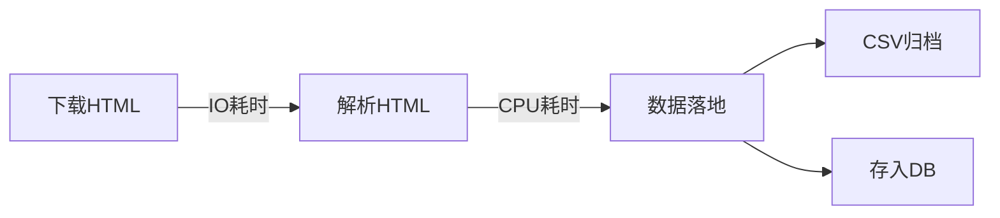

# 游戏贴吧数据爬取和分析

百度贴吧的游戏品类下面，包含所有游戏贴吧的入口链接。从[这个页面](http://tieba.baidu.com/f/fdir?fd=%D3%CE%CF%B7&sd=%B5%E7%D7%D3%BE%BA%BC%BC%BC%B0%D1%A1%CA%D6)入手，可以拿到所有游戏贴吧的人气数据，对游戏名称、游戏类型、关注者数量、帖子数量等进行数据分析。


## 大致思路

以[这张页面](http://tieba.baidu.com/f/fdir?fd=%D3%CE%CF%B7&sd=%B5%E7%D7%D3%BE%BA%BC%BC%BC%B0%D1%A1%CA%D6)为起点，按如下次序分别补完`游戏树`：

- 拿到贴吧类型的链接列表，比如“[客户端网游](http://tieba.baidu.com/f/fdir?fd=%D3%CE%CF%B7&sd=%BF%CD%BB%A7%B6%CB%CD%F8%D3%CE)”、“[桌游](http://tieba.baidu.com/f/fdir?fd=%D3%CE%CF%B7&sd=%D7%C0%D3%CE)”、“[游戏角色](http://tieba.baidu.com/f/fdir?fd=%D3%CE%CF%B7&sd=%D3%CE%CF%B7%BD%C7%C9%AB)”等
- 拿到这个`游戏分类`下面，所有的游戏贴吧列表，比如“[英雄联盟](https://tieba.baidu.com/f?kw=%E8%8B%B1%E9%9B%84%E8%81%94%E7%9B%9F&ie=utf-8)”、“[王者荣耀](https://tieba.baidu.com/f?kw=%E7%8E%8B%E8%80%85%E8%8D%A3%E8%80%80&ie=utf-8)”、“[超级马里奥](https://tieba.baidu.com/f?kw=%E8%B6%85%E7%BA%A7%E9%A9%AC%E9%87%8C%E5%A5%A5&ie=utf-8)”等
- 爬取每个游戏贴吧的首页，解析 HTML 获得其关注者数量、帖子数量

## 关键路径

爬取这些数据，需要考虑以下几点：

### 0. 广度优先 vs 深度优先

构建 `游戏树` 有两条路径：广度优先遍历和深度优先遍历，前者先获取**完整的**品类索引，然后获取**每个品类**下完整的所有贴吧链接，最后扁平化地便利每个贴吧。相比深度优先，广度优先能先**拿到索引信息**，而且在**断点续传**方面有天然优势，所以用膝盖想一下就能知道要采用广度优先的方式进行遍历。

### 1. 大量索引的本地缓存

光是游戏类型的索引链接，就分很多页，如“[客户端网游](http://tieba.baidu.com/f/fdir?fd=%D3%CE%CF%B7&sd=%BF%CD%BB%A7%B6%CB%CD%F8%D3%CE)”这个类型，包含 10314 个贴吧、分 52 页。

每次请求能获得 200 个游戏贴吧的链接，一共 59859 个游戏贴吧，光是索引的获取，就要进行 300 次 HTTP 交互。

爬虫可能会遇到失败，会需要进行重试，如果每次执行爬虫时，都要重新获取这些数据，是很麻烦的，而且这些数据属于 `冷数据` ，更新频率很慢。

所以要把 `游戏树` 的 json 数据，dump 到本地，下次启动爬虫时如果已经存在索引数据，直接加载使用即可。

### 2. 更大量子任务的分发




接近六万个贴吧，对每个贴吧获取其 HTML 文本、解析 HTML、数据入库，这里有这些坑：

- 百度不傻，有反爬虫机制，监测到爬虫行为时 HTTP 请求的时间会延长、差不多每个 HTTP 请求都要花费 >1.0 秒的时间才能返回
- 解析 HTML 也是耗时较长的任务，上面是 I/O 耗时，解析则是 CPU 耗时
- 入库时有冲突，这么大的数据量，必然不会串行爬取，而并行的话，如果对同一个 csv 文件、或者同一个 db 连接进行操作，肯定会遇到线程锁的问题

就既然已经预见到这些问题，不如趁早**绕路**走，而不是跳进 `反爬虫的坑`、`多线程的坑`。解决方法如下：

- 使用消息队列，不要自己编写多线程逻辑，将对六万个贴吧首页的爬取，扔到 celery 里去完成
- 每个任务自己搞定信息存储问题，不要过早入库、或者都写到一个文件里
- 编写**离线爬虫**，在消息队列搞定 HTML 的下载之后，在本地统一做解析、统计、入库逻辑
- （这条偷懒没做）如果解析 HTML 也耗时过久，将解析 HTML 的工作也扔进**消息队列**里，在各自的子目录暂存统计信息，最后再编写统一的入库脚本

**总体思想**就是，把 `I/O 耗时的 HTML 下载操作`、和 `CPU 耗时的解析操作` 解耦，<font color="red">**将有状态的任务拆解成无状态的任务，将在线爬虫改成离线爬虫，然后把耗时且重复的操作，扔给消息队列去处理**</font>。


## 食用方法

先拉起 redis 作为 celery 的后端，再启动 celery，最后启动爬虫。

```bash
# 接收6万个贴吧的子任务
redis-server &
/Users/pulsar/anaconda3/bin/celery -A asynctask worker --loglevel=info
# 爬取贴吧索引
python3 ./spider.py
# 消息队列结束后，执行离线爬虫
python3 ./spideroffline.py
# 消息存档和入库
python3 ./csv2sqlite.py
```

## 有趣的东西

来看一下马里奥系列，在贴吧的受众群体：


嗯，超马、马车、网球是最热门的。

大家关于王者荣耀，都关心哪些话题：


原来游戏物品交易、代练、账号买卖是大家最关心的话题。

那么总体上最火的贴吧是哪几个呢（人气数据很相近的贴吧，应该是同一个贴吧的重定向版本）？


逃（